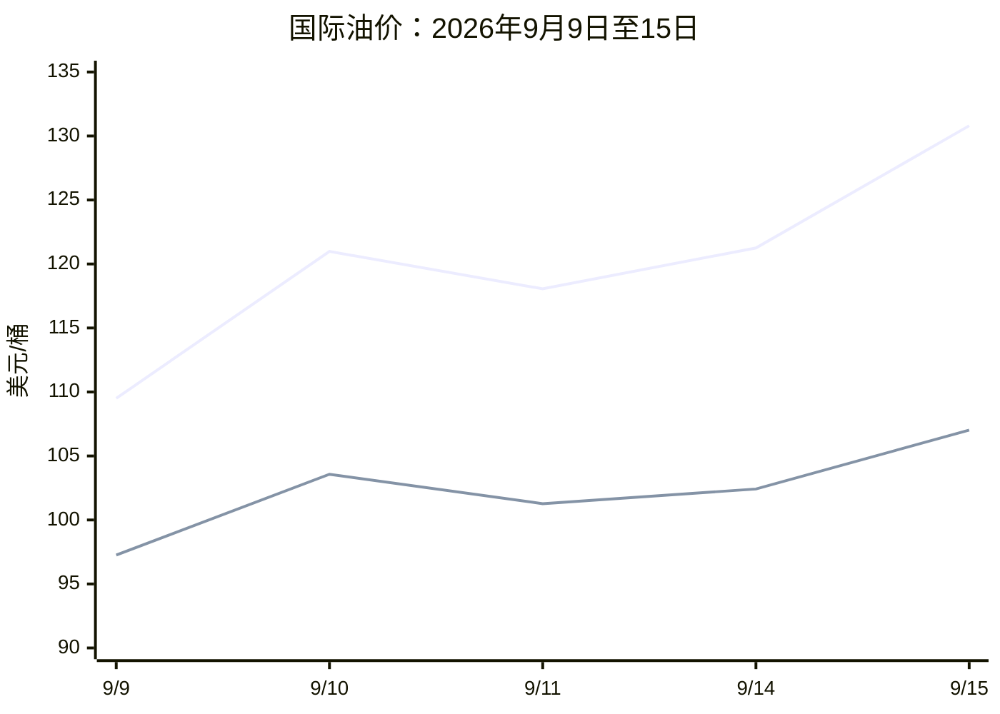
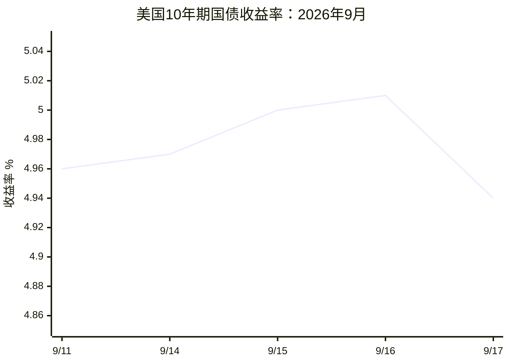
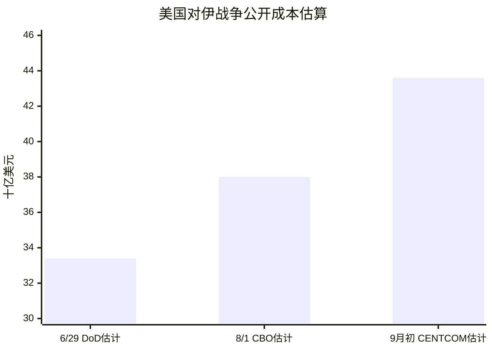
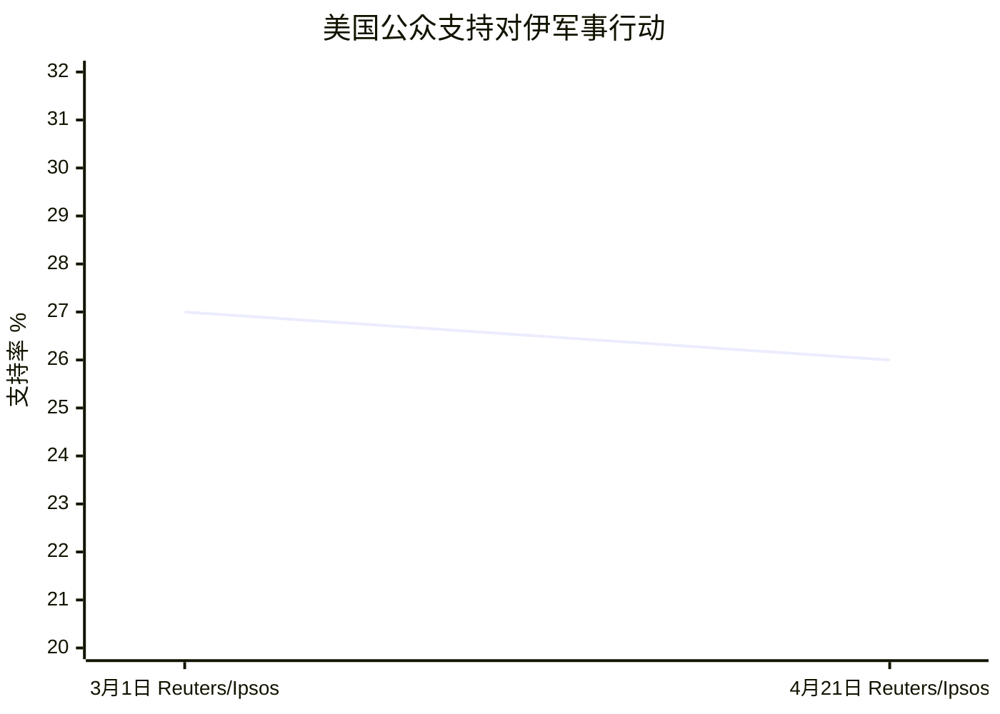
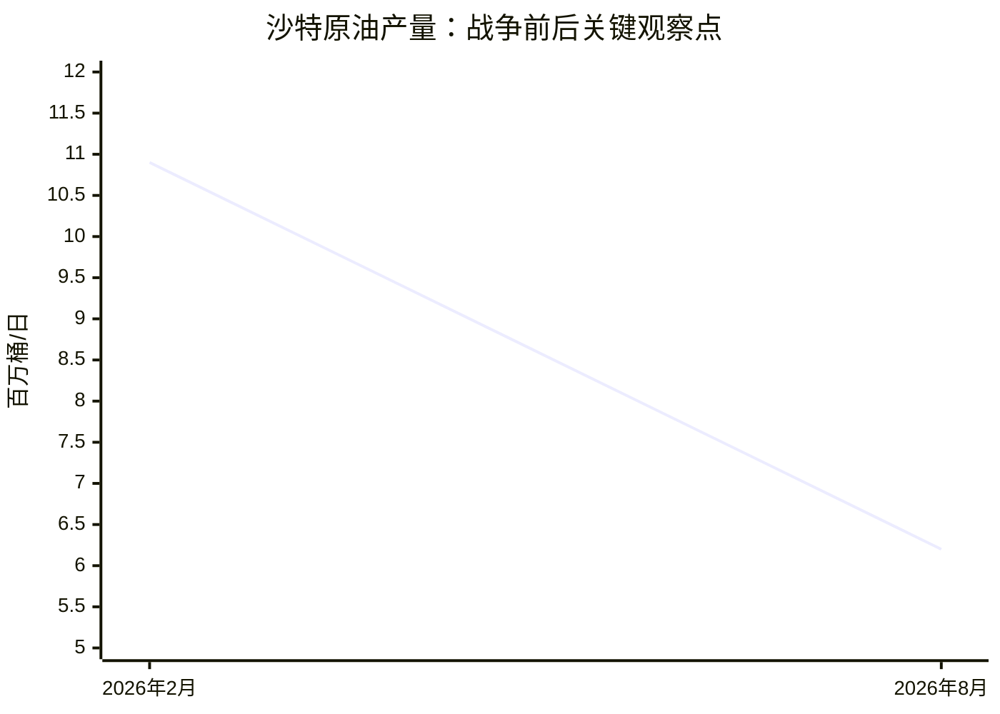

# 地缘政治跟踪框架深度研究报告：截至2026年9月19日

## 执行摘要

截至2026年9月19日，基于对用户提供的 **《地缘政治跟踪框架-20260907.xlsx》** 的实际解析，以及对2026年2月以来公开资料的逐项检索，本报告的总体判断是：**美伊冲突目前仍处于“高强度但受资源约束的长期化阶段”，俄乌冲突则处于“地面战线总体缓慢、远程打击和经济基础设施战显著强化、外交进程存在但尚不足以形成停火”的阶段。总体置信度为“中—高”；其中金融市场、美国军费/战争成本、公开军事行动、乌克兰援助等指标的置信度高，伊朗国内经济、精确弹药库存、精确舰艇位置、伊朗权力结构以及部分外交幕后活动只能达到中或低置信度。**

Excel中共有一个工作表“跟踪指标”，表头为“地缘重点—跟踪类别—跟踪指标”，共 **13条复合跟踪项**：美伊冲突8条、俄乌冲突5条。原表大量指标实际上由多个独立变量组成，而且**没有统一规定地理范围、采样频率、计量口径、预警阈值及数据源优先级**；因此这些参数在下文均标记为“**未指定**”，并进一步拆解为48个可独立监测的指标。

美伊方向最重要的变化是：美国自2月28日开始对伊军事行动后，公开战争成本迅速上升。美国国防部监察体系披露的估计显示，截至6月29日前四个月成本约 **334亿美元**，其中约223亿美元为弹药消耗、37亿美元为装备损失、74亿美元为额外作战费用；CBO此后估算截至8月1日约 **380亿美元**，并估计继续作战约增加20亿—30亿美元/月；CENTCOM后续估计到9月初约 **436亿美元**。由于三个统计口径并非完全一致，不能机械拼接，但方向高度一致：**财政和高端弹药的边际约束正在成为美国继续扩大作战规模的实质限制条件。** citeturn1search23turn10news29turn0news41

同时，伊朗已经从陆上导弹/无人机报复延伸到海上，美国CENTCOM在9月5日明确确认伊朗曾攻击一艘美国航母和一艘导弹驱逐舰，美方随后摧毁三艘IRGC油轮；这意味着Excel所写“当前已经直接攻击美军海上作战平台”已经得到美军官方确认。citeturn15search32 但**尚没有高等级公开来源能够确认伊朗进行了核武器试验，也没有检索到截至9月19日美国已经攻击“镐山”（Kuh-e Kolang Gaz La/Pickaxe Mountain）的官方确认**；新华社7月下旬仍报道美方只是在公开讨论打击可能性，因此“袭击镐山收尾”目前应记为“**公开信息未证实发生**”，而不能记作“已发生”。citeturn6search6turn6search11

金融战线已经成为最清晰的升级传导渠道。EIA经FRED发布的现货数据表明，Brent由9月9日的 **109.51美元/桶** 上升至9月15日的 **130.80美元/桶**；WTI同期由 **97.26美元** 上升至 **107.02美元**。美国10年期国债收益率9月中旬一度逼近5%，9月16日为5.01%，反映能源冲击与通胀风险重新进入期限溢价。citeturn4view0turn4view1turn4view2turn23news41 沙特绕开霍尔木兹的东西向输油管道又遭袭击，沙特原油产量从2月约 **1090万桶/日** 降至8月约 **620万桶/日**，表明霍尔木兹与曼德海峡两条风险通道已经出现联动。citeturn21news35

美国国内政治约束也在显著增强。Reuters/Ipsos在3月初调查中只有 **27%** 的美国受访者支持美以对伊打击；4月下旬支持率约 **26%**；ABC/Washington Post/Ipsos 4月24—28日调查则有 **61%** 认为动用武力是错误。9月15日美国众议院第三次通过要求结束未经国会授权伊朗战争的战争权力决议，票数为 **220比204**，包括7名共和党议员赞成。因此原Excel中的“美国反战情绪”现在已经不仅是民意指标，而正在转化为实际国会约束。citeturn10news49turn10news50turn9search7turn23news42

俄乌方向的核心判断则是：**地面战争尚未出现足以结束战争的战略突破，但战争重心越来越向无人机、弹道导弹、防空系统、炼厂、电力、铁路、港口和黑海航运等“战争经济基础设施”迁移。** 俄罗斯仍在顿涅茨克、特别是康斯坦丁尼夫卡方向施压，而乌克兰持续以远程无人机攻击俄罗斯炼厂；到9月中旬，俄罗斯主要柴油炼厂中约一半已不同程度减产或停产，IEA数据显示2026年前8个月俄罗斯炼厂平均约每三天遭遇一次无人机攻击。citeturn16news46turn18news41

乌克兰对西方援助依赖仍然极高，但“后援枯竭”暂时并没有得到数据支持。北约在2026年安卡拉峰会上承诺成员国全年提供 **700亿欧元**军事装备、援助和训练；欧盟9月又宣布拨付 **33亿欧元**用于导弹和无人机采购；丹麦加速了约2.76亿美元防空援助。与此同时，乌克兰单日/单轮无人机拦截率可以达到90%以上，但对弹道导弹仍存在明显短板，因此“乌克兰防空能力”不能只看拦截百分比，而要分成低速无人机、巡航导弹和弹道导弹三套指标。citeturn17search30turn17news42turn17news43turn16news45

俄罗斯国内经济尚未达到危机状态，但压力已经由“隐性机会成本”转向可观测的财政和实体约束：最新报道显示联邦财政赤字约相当于GDP的 **2.8%**，失业率低至 **2.2%**，后者与其说是经济强劲，不如说同时反映战争动员、人口流出和劳动力供给紧张；炼厂受袭又迫使俄方限制汽油、柴油和航空燃料出口。citeturn19news42turn18news41 9月18—20日俄罗斯国家杜马选举正在进行，因此截至本报告日期 **尚不能填写最终选举结果**。citeturn16news41

法国和意大利2027年的政治变量目前仍应作为**风险因子而非确定事件**。9月14日的法国民调显示Marine Le Pen仍是2027总统选举领先者，但这并不足以推导其必然获胜，更不能直接推导欧盟对乌援助必然中断。citeturn20news44 意大利方面，Meloni政府已经明显进入选举政策周期，但其选举结果和未来对乌政策均高度不确定。citeturn20news39turn20news40

**网页及数据库统一获取日期：2026年9月19日，America/Los_Angeles。** 文中引用标记均可直接打开对应来源。对于无法获得公开原始值或权威时间序列的数据，本报告没有以估算值冒充原始数据，而是明确标为“未获取/未公开”。

## 框架解析、口径与未指定项

Excel并不是已经完成口径标准化的数据字典，而更接近一个“情报问题清单”。例如“美国军舰位置、美军弹药库存、军费开支、CENTCOM表态、基地后勤能力、是否袭击镐山”全部位于同一单元格，却分别属于位置数据、库存数据、流量数据、文本事件、能力判断和二元事件变量。如果后续要长期自动化跟踪，建议把它们拆成独立字段。

时间范围统一按用户要求处理为 **2026-02-01—2026-09-19**；美伊战争本身则以2026年2月28日开始的大规模军事行动作为主要事件断点。CENTCOM官方将本轮行动列入其2026年针对伊朗的作战行动体系。citeturn0search9

Excel没有明确地理范围、频率和多数指标的统计口径。因此，下列三套假设均合理，其中本报告实际使用 **B方案**：

| 假设方案 | 地理范围 | 频率 | 数据口径 | 适用场景 |
|---|---|---|---|---|
| A：战术型 | 仅直接交战区；美伊为伊朗—波斯湾—以色列，俄乌为乌克兰国际承认领土及毗邻俄境 | 舰船/市场每日，军事事件每日 | 只采用官方确认事件；没有官方则记NA | 最严谨，但信息滞后、漏报多 |
| **B：基准型，本报告采用** | 直接战区＋海湾、红海、也门、沙特/伊拉克；俄乌扩展到黑海及欧洲直接支援国 | 市场每日；战线/援助每周；宏观经济每月 | 官方优先，国际组织次之，主流媒体引用商业数据库可作为替代 | 最适合持续地缘风险监测 |
| C：战略型 | 纳入全球能源、金融市场和主要盟友国内政治 | 市场周度、宏观月/季度、政治事件制 | 官方＋商业情报＋媒体＋智库综合指数 | 适合资产配置/战略规划，而非事实核验 |

原框架中还有几个必须特别标记的“**未指定**”问题。

“美国军舰位置”没有规定需要舰队、航母打击群还是具体舰艇；精确实时军舰位置还受到作战安全限制。“美军弹药库存”没有指定弹种，Patriot、THAAD拦截弹、Tomahawk、JASSM、LRASM和空射精确弹药的库存约束完全不同。“伊朗物价”没有指定CPI、食品CPI还是具体食品篮子。“里亚尔汇率”没有指定官方汇率、NIMA/商业汇率还是街头自由市场汇率。“原油出口规模”没有指定装船量、离港量还是实际到港量。“美股三大股指”没有指定收盘价还是累计收益率。“美联储加息预期”没有指定Fed Funds期货概率、OIS还是SEP。

“特朗普TACO”也不是正式统计变量，Excel没有定义，故口径为**未指定**。最合理的可量化方法是：记录总统每一次明确升级威胁，并检查其后7、14、30日是否实际执行；将“未执行、延期、明显缩减或改为谈判”的事件数除以全部明确威胁数，形成“威胁—执行偏离率”。这个指标比主观评价“是否TACO”更适合时间序列。

“回到备忘录”和“回到安克雷奇框架”均没有在Excel中给出具体文件名、签署日期或条款，因此必须标记为**未指定**。对于“安克雷奇框架”，至少存在三种合理解释：一是某次美俄高层会晤形成的政治谅解；二是随后美国提出的停火/领土安排框架；三是把后续“顿巴斯自由经济区”等建议笼统称为安克雷奇框架。2026年8月乌方公开表示已与美欧形成一页式方案，其中包含停火和顿巴斯第三方管理的自由经济区构想，但公开报道并未把它明确等同于Excel所写的“安克雷奇框架”。citeturn23search1turn23search9

本报告置信度按用户要求执行：**高**＝官方/国际组织原始数据或多个一级信源相互印证；**中**＝主流媒体、商业卫星/AIS/航运数据库或单一官方声明，存在统计盲区；**低**＝公开信息严重不足、预测性指标、幕后政治或主要依赖二手材料。对于商业Kpler/AIS等数据，即使由Reuters报道，也不会上调到与政府原始统计相同的等级。

## 美伊冲突指标清单与证据

| 指标名 | 定义与可量化数据项 | 时间序列需求及未指定项 | 已获取数据、权威来源与关键变化 | 结论与置信度 |
|---|---|---|---|---|
| **美军舰艇位置**〔美军战备〕 | 航母/两栖舰/驱逐舰在波斯湾、阿拉伯海、红海的存在；可量化为舰艇数、航母打击群数、事件位置 | 2026-02—今，建议每日/每周；**舰型范围、位置精度未指定** | CENTCOM确认9月5日IRGC攻击一艘美国航母及一艘导弹驱逐舰，两舰规避成功；美方随即攻击三艘IRGC油轮。citeturn15search32 | **美海军仍直接处于伊朗反舰武器威胁圈内。高。** 事件为CENTCOM官方确认；但精确部署坐标不能由公开资料完整重建。 |
| **美军弹药库存**〔美军战备〕 | 重点应拆为Patriot/THAAD拦截弹、远程精确打击弹药、海空防御弹药；库存量、消耗量、月补充量 | 建议月度；**弹种和最低安全库存未指定** | DoD监察资料经CBS报道，截至6月29日弹药消耗约223亿美元，并指出“战略库存短缺”和工业补充瓶颈；Reuters引述CBO称长程精确弹药消耗严重、补库需要多年。citeturn1search23turn10news29 | **库存压力已经从推测变成公开审计问题，但具体枚数仍未公开。中—高。** |
| **美国战争成本/军费**〔美军战备〕 | 累计增量作战成本、弹药、装备损失、年度国防预算 | 建议月度 | 6月29日前四个月约334亿美元；CBO截至8月1日约380亿美元、继续作战约20亿—30亿美元/月；9月初CENTCOM相关估计升至约436亿美元；政府同时寻求约1.5万亿美元级军费预算及额外资金。citeturn1search23turn10news29turn0news41 | **作战财政成本呈稳定上升趋势。高（方向）/中（不同机构绝对值比较）。** |
| **美军基地后勤补给能力**〔美军战备〕 | 基地受袭、跑道/油料/防空损失、补给航线、维修周期 | 周度；**基地清单和“能力”评分标准未指定** | DoD监察信息显示科威特、巴林、卡塔尔、阿联酋、沙特、伊拉克、阿曼、约旦的美军设施均受到不同程度影响。citeturn1search23 | **区域基地体系受到持续消耗，但尚无证据表明体系性瘫痪。中。** 公开数据没有基地级维修/库存量。 |
| **是否袭击“镐山”**〔美军战备〕 | 二元事件：0未确认，1确认；补充武器类型、破坏程度 | 事件制；**“收尾”的军事标准未指定** | 7月22日前后，美方公开暗示具备打击能力，但新华社仍将其描述为待决策对象；本轮检索未发现截至9月19日官方确认已经实施打击。citeturn6search6turn6search11 | **当前应填“公开未证实遭袭”，不是“确认未袭”。中。** 缺乏目标内部核查和最新IAEA访问。 |
| **伊朗直接攻击美海上平台**〔伊朗战备〕 | 攻击次数、武器类型、是否命中、伤亡 | 每次事件 | 9月5日CENTCOM正式确认IRGC瞄准美国航母和导弹驱逐舰，美方称无人员伤亡。citeturn15search32 | **Excel判断已获美国官方确认。高。** |
| **伊朗升级梯度**〔伊朗战备〕 | 海上攻击→盟友能源设施→海底通信→核门槛；建议做0—4级事件指数 | 每周；**原表无升级等级定义** | 霍尔木兹航运限制、油轮袭击和对美舰攻击均已出现；IAEA目前仍无法充分核查伊朗约440.9公斤60%丰度浓缩铀库存。citeturn7news42turn7news40 | **已处于海上/能源强制阶段，但“切海缆”“核试验”没有高等级信源确认。高（已发生部分）/低（未来路径）。** |
| **核武器试验**〔伊朗战备〕 | 地震学异常＋官方声明＋放射性核素证据 | 实时 | 本轮权威来源检索未发现2026年2月以来伊朗已进行核武试验的确认；IAEA关注重点仍是受损设施和高浓铀核查。citeturn7news42 | **暂记0/未确认。中—高。** 真正地下试验需CTBTO等进一步确认。 |
| **霍尔木兹海峡通行量**〔金融战线〕 | 每日通过油轮、LNG船、全部商品船；艘次及载重吨 | 建议每日；**船型口径未指定** | Kpler经Reuters：9月7日商品船约7艘通过，前一日8艘；9月中旬日通行量已降至个位数，且存在AIS关闭造成漏计。citeturn0search25turn7news40 | **通航明显低于正常水平，但精确数量具有AIS系统性低估风险。中。** |
| **曼德海峡通行量**〔金融战线〕 | 每日船舶/油轮艘次；建议与好望角绕航量联动 | 每日；**船型未指定** | Kpler显示9月7日约29艘商品船通过，前一日17艘；与此同时胡塞向Perim岛/曼德海峡核心位置推进，风险显著上升。citeturn0search25turn0search18 | **物理通航尚未完全停止，但军事风险急剧提高。中。** |
| **Brent原油**〔金融战线〕 | 美元/桶现货/近月期货 | 每日；**Excel未指定现货还是期货，本报告采用EIA现货** | 9/9 109.51→9/10 120.98→9/11 118.06→9/14 121.25→9/15 **130.80美元/桶**。EIA/FRED。citeturn4view0 | **能源风险溢价显著上升。高。** |
| **WTI原油**〔金融战线〕 | 美元/桶 | 每日；同上 | 9/9 97.26→9/10 103.57→9/11 101.27→9/14 102.42→9/15 **107.02美元/桶**。EIA/FRED。citeturn4view1 | **方向与Brent一致，但Brent风险溢价更明显。高。** |
| **美国战略石油储备SPR**〔金融战线〕 | SPR周度库存、周变化、可覆盖天数 | 周度；**“库存”是否含商业库存未指定** | EIA为正确原始来源，但本轮自动检索未能稳定抽取2026-02—09的完整SPR周度值。 | **数据项可公开获得但此次未完整抽取，故不填估算值。低（本报告数据完整度），来源质量本身高。** |
| **美国10Y国债收益率**〔金融战线〕 | 10年期国债市场收益率 | 每日 | 9/11 4.96%、9/14 4.97%、9/15 5.00%、9/16 5.01%、9/17 4.94%；一度逼近5%。Fed/FRED。citeturn4view2turn23news41 | **能源通胀冲击已明显传导至长端收益率。高。** |
| **道琼斯/S&P 500/Nasdaq**〔金融战线〕 | 指数收盘点位及累计收益率 | 每日；**基准日未指定** | FRED提供DJIA、SP500、NASDAQCOM官方授权日序列。9月15日市场压力下，道指跌0.63%、标普跌0.45%、纳指跌0.78%。citeturn23view1turn23view2turn23view3turn7news41 | **风险资产受到油价和利率共同压制，但尚不能仅凭单日走势判断结构性熊市。高（价格）/中（地缘归因）。** |
| **美联储加息预期**〔金融战线〕 | FOMC目标利率、Fed Funds期货/OIS概率、SEP | 每次会议＋每日市场 | 7月29日FOMC目标区间仍为3.50%—3.75%；截至9月18日Fed官网显示3.75%—4.00%，表明9月会议已上调25bp。citeturn22search35turn22search31 | **美伊战争引发的能源通胀已经改变此前的宽松路径。高（实际政策）/中（未来概率）。** |
| **反战民意**〔美国民意〕 | 支持/反对军事行动，认为战争错误比例，Trump处理战争支持率 | 每2—4周 | Reuters/Ipsos 3/1支持打击27%；4/21约26%；ABC/WP/Ipsos 4/24—28调查61%认为动武是错误。citeturn10news49turn10news50turn9search7 | **反战/质疑战争的民意已构成稳定多数。高。** 多个大型主流民调方向一致。 |
| **战争权力决议**〔美国民意/政治〕 | House/Senate表决票数、跨党派倒戈人数 | 每次表决 | 9月15日众院以220—204第三次通过结束未经授权战争的决议，7名共和党人支持。citeturn23news42 | **国会约束由象征性反对转向可量化跨党派压力。高。** |
| **Rand Paul、Murkowski、Collins等个人动向** | 投票、共同提案、公开讲话 | 事件制 | Congress.gov在本轮自动检索中受访问限制，未完成所有指定参议员2026年逐票核对；因此不以媒体印象替代roll call。 | **未完整获取。低。** 应直接接Congress.gov/Senate roll-call数据库。 |
| **Tucker Carlson、Joe Kent等意见领袖** | 公开反战内容数量、受众量、与政府互动 | 周度 | 未获取足够高等级、可连续比较的原始时间序列。 | **未完整获取。低。** 应使用本人节目/官方账号＋Media Cloud/GDELT，而非二手剪辑。 |
| **以色列大选**〔以色列动向〕 | 党派民调、席位预测、联盟席位；最终结果 | 周度 | 投票日为 **2026年10月27日**，因此截至9月19日没有“10月大选结果”。Reuters最新汇总显示中间派Yashar约领先Likud 3个百分点，反内塔尼亚胡阵营席位投影约66席，但联盟形成仍不确定。citeturn11news41 | **“结果”尚未来临；当前只能跟踪民调。高（时间事实）/中（选举预测）。** |
| **内塔尼亚胡及加沙/黎巴嫩军事动向** | 空袭次数、伤亡、停火违规、黎巴嫩南部行动 | 每日/周度 | 9月19日仍有以军在加沙实施打击；黎巴嫩南部也继续出现针对真主党目标的行动。UNIFIL撤出过渡安排与以军继续拆除行动并存。citeturn11news39turn11news40 | **多线低/中强度军事行动仍在延续。高。** |
| **叙利亚/约旦河西岸军事动向** | 事件次数、控制区、伤亡、定居点/军事行动 | 周度 | 本轮没有取得足够完整的2026-02—09逐周原始序列。 | **信息缺口。低。** 可接IDF、OCHA OPT、ACLED形成统一事件库。 |
| **“麦加防务协议”成员**〔中东各国〕 | 正式签署国、新增成员、议会批准状态 | 事件制 | 8月7日沙特、土耳其、巴基斯坦签署“Mecca Joint Defence Agreement”；相对于原沙特—巴基斯坦安排，**可确认新增成员是土耳其**。条款包括“一方受攻击视为共同安全问题”，但具体军事义务并未完全公开。citeturn12news40turn12news38 | **土耳其加入为高置信度；所谓其他国家加入目前没有足够高等级证据。高/低。** |
| **沙特—胡塞战事**〔中东各国〕 | 导弹/无人机次数、领土、能源设施受损 | 每日/周度 | 胡塞已向红海沿岸及Perim岛推进，并多次袭击沙特；9月16日沙特方面称在麦加以南拦截胡塞无人机。citeturn0search18turn12news37 | **冲突已从也门内部升级为直接威胁沙特本土和两大海运通道。高。** |
| **沙特东西向管道** | 输送能力、停运天数、替代出口能力 | 每日 | 管道平时可向Yanbu转运约400万桶/日；遭无人机攻击后停运，修复估计数周。沙特原油产量2月约1090万桶/日、8月约620万桶/日。citeturn21news35turn13news43 | **霍尔木兹的关键绕行方案自身也成为攻击目标，全球能源系统冗余下降。高。** |
| **伊拉克亲伊朗民兵袭美军** | 攻击次数、基地、伤亡、组织认领 | 每日 | 本轮未获得足够完整的CENTCOM＋伊拉克官方逐事件汇总。 | **未完整获取。低。** 后续应联合CENTCOM、Iraqi Joint Operations Command和ACLED。 |
| **伊朗食品价格/通胀**〔伊朗内政〕 | CPI、食品CPI、面包/肉类/米等价格 | 月度；**食品篮子未指定** | AP报道9月伊朗经济状况因封锁、战争和制裁进一步恶化，但本轮没有获得伊朗统计中心可验证的2026年2—9月食品CPI完整序列。citeturn15news41 | **通胀压力方向明确，精确月度幅度不能可靠填值。中（方向）/低（具体数值）。** |
| **伊朗里亚尔汇率** | 官方、商业或自由市场IRR/USD | 每日；**口径严重未指定** | 官方与自由市场存在多重汇率，本轮未取得可审计的自由市场每日原始序列。 | **不建议把官方汇率直接作为居民购买力指标。数据缺口。** |
| **伊朗青年失业率** | 15—24岁或15—29岁青年失业率 | 季度；**年龄定义未指定** | IMF WEO提供宏观数据库入口，但未取得2026年高频青年失业原始值；战时统计亦有显著滞后。citeturn21search14 | **无法高置信度判断2026年2月以来变化。低。** |
| **伊朗原油出口** | 装船量/实际到港量，万桶/日 | 日/周/月；**统计口径未指定** | 公开高频数据主要依赖Kpler/Vortexa/卫星，而非伊朗官方；本轮没有取得覆盖2—9月的统一公开序列。Reuters同时报道美国封锁正持续压缩伊朗出口能力。citeturn21news36 | **出口承压高置信度，具体bpd时间序列中置信度。** |
| **汽油短缺/限电**〔伊朗内政〕 | 加油排队时间、配给政策、停电小时数 | 周度 | 目前主要为媒体和居民层面报道，缺乏全国统一战时原始数据库。AP确认经济条件恶化，但不足以量化全国停电。citeturn15news41 | **可能存在显著压力，但全国量化结论暂为低—中置信度。** |
| **文官政府 vs IRGC权力结构** | 高层任免、作战决策权、IRGC公开露面、政府政策被否决次数 | 事件/每月 | 9月18日政府组织的大型集会由Pezeshkian及Basij/安全体系共同动员，超过30万人参加、登记军事训练志愿者逾60万，显示安全机构仍具有极强组织能力。citeturn15news41 | **没有证据显示文官政府已取代安全机构成为核心强制力量；IRGC/Basij体系仍具关键权力。中。** 权力交易本身不透明。 |
| **最高领袖权威/公开露面** | 每月公开讲话、现场露面、重大任命 | 每月 | Excel未明确究竟跟踪“公开露面频次”还是“实际决策权”。本轮搜索对2026领导层变动取得的高等级一手来源不足，因此不使用低等级资料填充。 | **当前属于重大数据缺口。低。** 应锁定leader.ir、IRNA、伊朗宪制机构公告逐日建立事件表。 |
| **巴基斯坦/卡塔尔/阿曼斡旋**〔外交斡旋〕 | 正式访问、三方会议、停火提案、延期/取消 | 事件制 | 原定在阿曼举行的海峡相关地区外交会议9月被推迟；沙特要求延期，表明目前降温机制仍然脆弱。citeturn15news43 | **斡旋渠道仍存在，但没有形成稳定的停火机制。高（会议状态）/中（效果判断）。** |
| **特朗普“TACO”倾向** | 建议指标：威胁后7/14/30日的执行率、延期率、转谈判率 | 每周；**Excel定义未指定** | 9月特朗普一方面仍提出强硬战争目标，另一方面又称伊朗希望达成协议、美国愿意谈判；这种威胁与谈判并存本身不足以证明“TACO”。citeturn22news41 | **不能以标签替代指标。目前“存在议价性摇摆”，但无法可靠量化为TACO指数。中。** |
| **是否回到“备忘录”** | 正式谈判文本、停火/MOU恢复 | 事件制；**具体备忘录未指定** | 没有明确文件名，无法做0/1判断。 | **应保持NA，不应自行猜测用户指哪一份MOU。** |

## 俄乌冲突指标清单与证据

| 指标名 | 定义与可量化数据项 | 时间序列需求及未指定项 | 已获取数据、权威来源与关键变化 | 结论与置信度 |
|---|---|---|---|---|
| **顿巴斯/顿涅茨克战线**〔军事战线〕 | 每周净占领面积、关键城镇控制、推进速度 | 每日/周度；**Excel未指定地图源和面积算法** | 俄罗斯仍集中争夺顿涅茨克，尤其康斯坦丁尼夫卡等战略城镇；独立核查与俄乌双方对部分控制情况仍存在差异。citeturn16news46 | **俄罗斯保持局部进攻压力，但没有证据表明已形成决定性突破。中—高。** |
| **哈尔科夫方向**〔军事战线〕 | 接触线、地面推进、城市/后方打击次数 | 周度 | 9月18日前后哈尔科夫州及Balakliia继续遭俄罗斯导弹/无人机袭击。citeturn16search1 | **哈尔科夫仍处高强度打击范围，但本轮资料不足以给出可靠的周度地面净推进公里数。中。** |
| **俄远程无人机打击** | 每日发射架次、拦截率、命中数 | 每日 | 9月12日前后一轮攻击中俄方使用近500架无人机；乌方9月另一轮称击落187个空中目标、无人机拦截率约93%。citeturn16news44turn16news45 | **规模化无人机战已是俄方战略打击主渠道。高。** |
| **弹道/巡航导弹战** | 发射数、拦截数、命中关键设施 | 每日 | 乌方公开承认相较无人机，弹道导弹仍然更难拦截，并持续寻求Patriot等能力。citeturn16news45 | **弹道导弹是当前乌防空最明显结构性缺口之一。高。** |
| **乌克兰远程打击俄罗斯本土** | 炼厂、军工、电力目标次数及损失产能 | 每周 | 2026年前8个月俄罗斯炼厂平均约每三天遭一次无人机打击；到9月中旬主要柴油炼厂中约一半减产/停产。citeturn18news41 | **乌方已形成可持续的俄罗斯能源工业压制能力。高。** |
| **黑海战线** | 商船/军舰遇袭、港口关闭、保险费率 | 每周 | 9月伦敦海险业将整个黑海进一步纳入高风险区，原因是商业航运攻击显著增加。citeturn16news42 | **海上战争正重新显著影响商业航运，而非仅限两国海军。高。** |
| **亚速海战线** | 舰船活动、港口、乌克兰远程攻击 | 周度；**具体监测范围未指定** | 本轮未取得足够连续的独立原始数据。 | **数据缺口。低。** 适合接AIS、卫星及双方海军公告。 |
| **乌克兰防空能力** | 分类拦截率、Patriot/IRIS-T/NASAMS弹药、保护城市数量 | 每日/周度 | 一轮攻击无人机拦截率可达约93%，但乌方强调弹道导弹防御仍不足；9月18日波兰加入乌克兰反弹道导弹合作。citeturn16news45turn16news39 | **无人机防御显著改善，弹道导弹防御仍是瓶颈。高。** |
| **西方援助总量**〔乌克兰后援〕 | 承诺额、已拨付额、军援/预算援助拆分 | 月度 | NATO 2026安卡拉峰会成员承诺全年约 **700亿欧元**军事装备、援助和训练，并称2027年至少维持相当水平。citeturn17search30 | **至少从官方承诺看，2026年西方援助尚未出现系统性中断。高。** |
| **欧盟军援** | 实际拨款、用途 | 月度 | 欧盟9月17日宣布次日向乌克兰拨付 **33亿欧元**用于采购导弹和无人机。citeturn17news42 | **欧洲正把援助进一步转向最紧缺的远程打击/防空消耗品。高。** |
| **单国武器援助** | 套件金额、系统类别 | 月度 | 丹麦加速约18亿丹麦克朗（约2.76亿美元）援助，重点为空防；波兰同时宣布新援助包但金额尚未披露。citeturn17news43turn17news39 | **欧洲防空支持仍在增加。高。** |
| **贷款/基础设施融资** | 主权贷款、能源贷款、预算融资 | 月度 | 美国DFC批准向乌克兰DTEK提供 **8500万欧元**贷款，用于电池储能；既是经济援助也是提高俄空袭下能源韧性的投资。citeturn17news41 | **金融援助正在从财政输血扩展到战时基础设施韧性。高。** |
| **美国情报分享** | 是否暂停/恢复；卫星、目标情报范围 | 事件制；**情报类别未指定** | 本轮未获取能够覆盖2—9月并准确区分“战略情报/实时目标情报”的官方连续记录。 | **不能仅凭媒体概述填“正常/中断”。低。** 后续应以White House/DoD/State正式声明为准。 |
| **俄罗斯国家杜马选举**〔俄罗斯内政〕 | 投票率、统一俄罗斯党席位、反战候选人数量 | 事件制 | 投票为9月18—20日；截至 **9月19日报告日期仍在进行**。Reuters称反战候选人总体受到严格限制。citeturn16news41 | **最终结果不可提前填写。高。** |
| **俄罗斯油品出口** | 柴油、汽油、航煤月出口量 | 月度 | 遭炼厂打击后俄方限制汽油、柴油和航空燃料出口；限制前柴油和gasoil出口平均约 **330万—340万吨/月**。citeturn18news41 | **能源收入与国内成品油供应正同时受到打击。高。** |
| **俄罗斯炼厂产能** | 停产产能、装置维修时间 | 周度 | Syzran、Saratov等炼厂9月因无人机袭击停运；Syzran主常减压装置约占该厂71%能力，维修预计至少一个月。citeturn18news42 | **炼厂成为乌军最有效的经济战目标之一。高。** |
| **俄罗斯财政赤字** | 联邦赤字/GDP、油气收入、NWF | 月度 | AP最新综合显示赤字约 **GDP的2.8%**、接近原目标近两倍；同时高油价为财政提供部分缓冲。citeturn19news42 | **财政恶化明显但尚非失控。中—高。** |
| **俄罗斯军费开支** | 国防支出卢布额、GDP占比、联邦预算占比 | 年度/月度执行 | 高军费是当前赤字扩大的主要因素之一，但本轮没有抽取到俄罗斯财政部2026年逐月国防科目可核验全序列。citeturn19news42 | **方向高置信度，精确月度执行值未获取。中。** |
| **卢布汇率** | CBR USD/RUB官方价＋市场价 | 每日；**口径未指定** | 本轮未成功抽取2026-02—09中央银行逐日完整系列，因此不填估算点位。 | **数据公开可得但本报告缺序列。低（完整度）。** 建议直接调用CBR API。 |
| **劳动力短缺** | 失业率、职位空缺、实际工资、企业缺工调查 | 月/季度 | 当前失业率约 **2.2%**；与此同时经济报道持续指出移民、动员和军工需求导致企业劳动力短缺。citeturn19news42 | **极低失业率在战争环境下应同时视为供给紧张信号。中—高。** |
| **法国2027总统选举**〔欧盟内政〕 | 首轮/次轮民调、RN候选人支持率、对乌政策 | 月度 | 9月14日Reuters报道Marine Le Pen在测试情景中仍为领先者，Mélenchon多数情景第二。citeturn20news44 | **RN胜选风险是真实变量，但距离投票仍远，不能写成基准确定结果。中。** |
| **法国援乌政治约束** | 援助预算表决、主要候选人政策 | 月度 | Macron政府9月仍公开强调支持乌克兰并应对俄罗斯混合威胁。citeturn20news41 | **至少截至9月19日，法国国家政策尚未转向削减对乌支持。高；2027情景中置信度低。** |
| **意大利2027选举** | 执政联盟/反对派民调、席位 | 月度 | Meloni政府已进入明显选举政策周期，并推动有利于联盟形成的选举法改革；选举结果仍不可预测。citeturn20news39turn20news40 | **应作为中期风险变量，不宜直接套用法国情景。中。** |
| **美国特使参与斡旋**〔外交斡旋〕 | 特使会议次数、俄乌双方参加情况 | 事件制 | 2月初美俄乌在阿布扎比谈判并促成314名战俘交换；3月美乌继续会谈，美国团队由Steve Witkoff、Jared Kushner等参与；8月乌方又向美方递交新的结束战争建议。citeturn23search17turn23search13turn23search9 | **美国斡旋意愿明确存在，并非退出议题。高。** |
| **乌克兰对和谈态度** | 是否接受停火、领土前提、安全保证 | 事件制 | 乌方8月称看到美国斡旋窗口至少延续到2027年夏，并提出停火、顿巴斯自由经济区等方案。citeturn23search1 | **乌克兰并非拒绝谈判，而是在领土、安全保证和执行机制上坚持条件。高。** |
| **欧盟对和谈态度** | 共同声明、参与谈判要求、制裁政策 | 月度 | 欧洲持续援助同时支持外交，但没有资料显示欧盟已接受以单方面削弱乌克兰安全为代价的停火；当前政策仍以提高乌方谈判能力为主。欧盟9月继续拨付33亿欧元军援。citeturn23news40 | **“援助+谈判”双轨仍是欧洲主流政策。中—高。** |
| **是否回到“安克雷奇框架”** | 是否正式引用特定框架及核心条款 | 事件制；**文件定义未指定** | 当前可验证的是新的一页式方案以及停火/顿巴斯自由经济区构想；未检索到高等级来源明确称其为“恢复安克雷奇框架”。citeturn23search1 | **当前应记“无法判定/NA”。低。** 首先需要确认Excel所指具体文件。 |

## 关键时间序列与趋势图

以下图表仅使用已经取得可核验数字的数据。对于2026年2月至今存在公开数据库但此次未完全抽出的序列，不使用插值或模型估算补齐。

**Brent与WTI近期加速上行。** 数据为EIA现货美元/桶，经FRED发布；两条线依次为Brent、WTI。citeturn4view0turn4view1

这一组数据最值得关注的不是WTI本身，而是**Brent相对WTI的风险溢价扩大**。这与全球海运原油较美国内陆原油更直接受到霍尔木兹、红海和沙特出口瓶颈影响的机制相符；但“价差全部由地缘政治造成”仍属于推断，不能由价格序列单独证明。沙特的替代出口能力又因东西向管道遇袭受到削弱。citeturn21news35

**美国10年期国债收益率已经重新测试5%附近。** 数据来源Federal Reserve/FRED。citeturn4view2turn23news41

这与油价变化同时发生，并且9月FOMC目标利率已经由7月底的3.50%—3.75%提高到3.75%—4.00%。因此框架中“油价—通胀—美联储—长债—美股”的传导链条已经有较强事实基础。citeturn22search35turn22search31

**美国战争成本呈阶梯式上升，但三组估算口径不同，图形只能反映量级，不能视作同一会计序列。** DoD监察口径截至6月29日约334亿美元，CBO口径截至8月1日约380亿美元，9月初CENTCOM相关估算约436亿美元。citeturn1search23turn10news29turn0news41

真正更值得作为预警指标的并非累计成本，而是**“月度弹药消耗÷工业月产量”与“关键弹种库存÷月消耗量”**。目前公开材料已经显示战略库存和补产存在瓶颈，但没有公开足够的弹种级库存枚数，因此这一关键指标暂时只能定性为红色预警，而不能计算精确“还能打几个月”。citeturn1search23turn10news29

**美国公众支持战争的水平在战争初期即处低位。**

3月和4月两个Reuters/Ipsos调查口径具有较强可比性；另外一个不同问法的ABC/Washington Post/Ipsos调查中，61%认为动武是错误，因此不能将61%直接接到上图同一序列，但它加强了同一方向的判断。citeturn10news49turn10news50turn9search7 到9月，政治效应已经表现为众议院220—204通过战争权力决议，而不是单纯停留在民调。citeturn23news42

**沙特原油生产体现了两大海峡风险的实体经济后果。**

Reuters报道的2月1090万桶/日至8月620万桶/日意味着六个月下降约 **43%**。这不是简单的需求调整，而发生在霍尔木兹运输受限、也门胡塞扩大战线及沙特东西向管道遭袭背景下，因此应将其作为“海峡封锁程度”的高权重代理指标。citeturn21news35

俄乌方面，最值得做固定图表的不是单日领土变化，而是**俄罗斯炼厂受袭频率、停产能力和油品出口量**。截至目前可验证信息显示：2026年前8个月炼厂平均约每3天遭一次无人机攻击；9月中旬六座重要柴油炼厂出现减产/停工，这些设施合计约占俄罗斯柴油生产的一半；限制前俄罗斯柴油和gasoil月出口约330万—340万吨。citeturn18news41 这说明乌克兰远程打击已经从“象征性深入俄罗斯”升级为可以影响国际成品油市场的经济战工具。

## 数据缺口、替代方案与监测建议

本轮研究中最重要的限制不是缺新闻，而是**很多框架变量本身没有一个公开、统一、可重复的原始数据库**。因此下面区分“数据客观不存在/不公开”和“数据存在但本轮未完整抽取”，二者不能混淆。

| 未完整获取内容 | 原因/局限性 | 建议替代方案 |
|---|---|---|
| **美军全部舰艇实时坐标** | 作战安全限制；公开AIS不能代表军舰 | 以USNI Fleet Tracker、CENTCOM/Navy官方图片定位、卫星图像做周度位置区间，而非伪精确经纬度 |
| **美军关键弹药实际库存枚数** | 多数属于敏感/机密数据 | 用DoD预算采购量、工业合同、年度产量、公开发射量建立“库存压力指数”；DoD IG/CBO作为校验 |
| **美国SPR 2026-02—09完整周序列** | EIA数据库公开，但本轮工具未稳定抽取完整序列 | 后续直接调用EIA API；字段固定为SPR ending stocks，单位千桶 |
| **霍尔木兹、曼德每日完整通航原始数据** | Kpler/Vortexa为商业数据库，AIS关闭导致系统性漏计 | 建议购买Kpler/Vortexa或MarineTraffic API；至少同时保存“全部船、油轮、LNG船、载重吨”四项，而非只记录艘数 |
| **Tucker Carlson、Joe Kent等意见领袖完整序列** | 没有天然统计变量 | 以GDELT/节目全文构建每周“反战内容次数＋受众量＋与政府互动事件” |
| **Paul/Murkowski/Collins等逐次战争权力投票** | Congress.gov自动访问受到限制 | 直接以Senate/House roll-call编号为主键建表，避免媒体二次描述 |
| **以色列10月大选结果** | 2026-10-27尚未发生 | 当前只能跟踪民调、席位模拟和联盟可能性；大选后立即切换为实际席位及组阁概率 citeturn11news41 |
| **以军叙利亚/西岸完整时间序列** | 本轮未抓取足够完整事件集 | IDF＋OCHA＋ACLED三源交叉；分别记录叙利亚、West Bank、Gaza、Lebanon，不能合并成一个“军事活跃度” |
| **伊拉克亲伊民兵袭美军完整事件集** | 组织认领与美方确认往往不一致 | CENTCOM＋伊拉克Joint Operations Command＋ACLED；设计“声称/官方确认/伤亡”三字段 |
| **伊朗食品CPI** | 战时官方统计滞后且数据口径可能变化 | SCI官方CPI优先；World Bank/IMF仅用于年度校验；媒体菜价不能替代CPI |
| **伊朗里亚尔汇率** | 多重汇率制度 | 必须同时保存官方、商业和自由市场三个序列；判断居民压力时优先自由市场，但明确其非官方性质 |
| **伊朗青年失业率** | 高频公开值不足、年龄定义不一 | 固定15—24岁ILO口径；季度更新，不用月度媒体估计 |
| **伊朗原油出口** | 官方数字可信度/及时性不足，AIS规避频繁 | Kpler、Vortexa、TankerTrackers三源中位数；同时记录“装船”和“到港”防止重复 |
| **伊朗停电/燃油短缺全国指标** | 缺全国统一实时数据库 | 建立省级事件数据库：限电小时、停电人口、加油站配给、炼厂事故；官方电力公司优先 |
| **伊朗最高领袖公开露面/权力结构** | 高度定性且当前高质量连续资料不足 | 对leader.ir、IRNA、总统府、IRGC官方媒体做事件编码：现场露面、视频讲话、任命、军事会议、总统政策被推翻等 |
| **“备忘录”** | Excel未指出是哪份MOU | 必须先给这一变量绑定具体文件标题/签署日期，否则保持NA |
| **俄乌精确周度占领面积** | 地图源之间边界认定有差异 | 固定一个地理数据源，不在ISW、DeepState和双方官方地图间来回切换；以平方公里净变化计算 |
| **亚速海海上战线** | 商船/军事活动混杂 | 商业AIS＋卫星＋乌/俄海军公告三源交叉 |
| **美国对乌实时情报分享状态** | “情报分享”含义过宽且部分不公开 | 至少拆为战略预警、卫星图像、实时目标数据、远程武器目标支持四项，每项0/1/部分 |
| **俄罗斯2026军费月度执行** | 预算分类及战时支出透明度下降 | 俄罗斯财政部预算执行＋SIPRI/IISS年度估计；不要将预算计划等同实际支出 |
| **俄罗斯卢布2—9月完整日线** | 本轮未完整抽取 | 直接连接CBR官方API；同时保存美元/卢布与人民币/卢布 |
| **俄罗斯杜马最终结果** | 9月19日仍处投票阶段 | 9月20日后使用俄罗斯中央选举委员会最终认证结果；投票结束前不使用出口民调替代 citeturn16news41 |
| **法国2027选举胜率** | 距投票仍远，候选资格、联盟均可变化 | 每月保存所有一轮、二轮情景，不只记录“谁领先”；当前Le Pen领先只能作为一个时点证据 citeturn20news44 |
| **意大利2027选举及对乌政策** | 选举法仍在调整、联盟结构可能变化 | 将Meloni支持率、执政联盟总支持率、Ukraine aid议会表决分开跟踪 citeturn20news40 |
| **“安克雷奇框架”** | Excel没有准确文件定义 | 在数据库里保持NA；候选解释分别建字段，直到确认具体文件。不要把8月“一页式方案”自动等同于安克雷奇框架 citeturn23search1 |

从长期跟踪价值看，原Excel还应增加一个“**领先指标/滞后指标**”标签。市场价格、军舰部署、空袭次数和民调属于领先或同步指标；财政赤字、失业率和选举结果属于滞后指标。如果全部放在同一观察层级，很容易在分析时将“已经发生的后果”和“未来升级概率”混淆。

同时建议为每个指标增加四个结构化字段：**基线值、最新值、变化率、预警阈值**。例如霍尔木兹不应只写“通行量下降”，而应设为“7日平均艘次/战前7日平均艘次”；美军弹药则设为“估算月消耗量/工业月产量”；俄罗斯炼厂设为“不可用一次加工能力/全国总能力”；乌克兰防空必须分别记录无人机、巡航导弹、弹道导弹拦截率。这样才能把目前偏文本化的框架变成真正可用于预警的仪表盘。

截至2026年9月19日，综合全部可验证信息后，最值得放在仪表盘最上方的五个高频预警变量是：**霍尔木兹与曼德海峡7日平均通行量、Brent及Brent-WTI价差、美国高端弹药库存压力、沙特替代出口能力、俄罗斯炼厂不可用产能。** 前三个决定美伊战争能否继续向全球金融和美国国内政治传导；后两个分别决定中东和俄乌战争能否把军事消耗转化为持续性的全球能源冲击。霍尔木兹通行已降至极低水平、Brent已突破130美元附近、沙特绕行能力遭到攻击、美国公开审计已出现弹药补充警告，而俄罗斯炼厂也遭遇持续高频无人机攻击。citeturn7news40turn4view0turn21news35turn1search23turn18news41

因此，**当前两场冲突最大的共同趋势不是“哪一方马上取得决定性军事胜利”，而是战争正越来越系统性地攻击对方的补给、能源、运输、财政和政治承受力。** 在美伊方向，这表现为海峡—油价—通胀—利率—美国民意和国会的反馈链；在俄乌方向，则表现为无人机—炼厂/能源/铁路—成品油供应—财政与后援体系的反馈链。前者当前升级速度更快、全球尾部风险更大；后者短期变化更慢，但其消耗结构更稳定、更具长期性。这个结论对公开军事事实和宏观传导的**总体置信度为中—高**；对伊朗内部权力变化、秘密外交、弹药真实库存及未来选举结果的判断仍应维持**中或低置信度**，不应以推测填补公开数据空白。